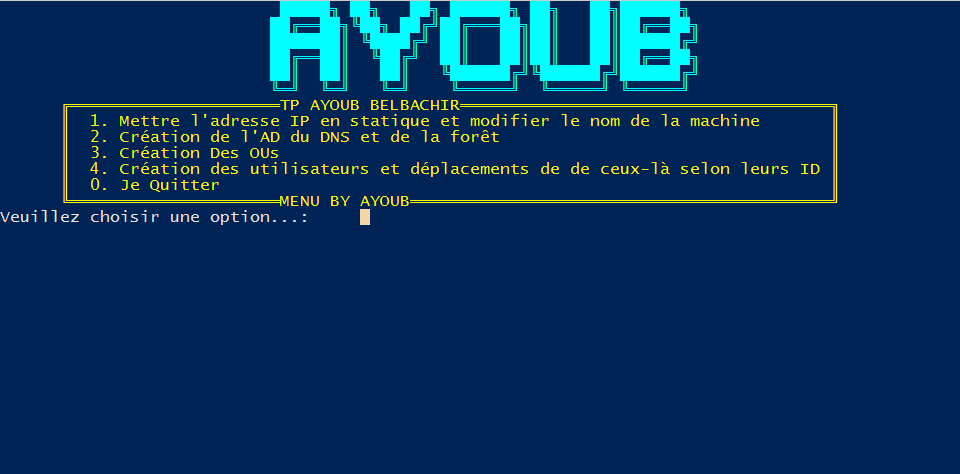

# (｡◕‿‿◕｡) ```Ayoub-Belbachir``` 


  [//]: # ()


Tous les fichiers doivent tous être déposés dans le répertoire suivant ```C:\Windows\SCRIPT_AYOUB_BELBACHIR``` . Pour une meilleure expérience d’immersion je vous conseille aussi activer le son.


internet et conseiller pour le script 3, j'installe un gestionnaire de paquets pour Windows ```CHOCO``` et un module complementaire telle que [BurntToast](https://github.com/Windos/BurntToast) pour afficher des notification popup perssonaliser 

# Les etapes à suivre 


  :white_check_mark: Avoir internet

  :white_check_mark: Télécharger mon repository

  :white_check_mark: placer le directory ```SCRIPT_AYOUB_BELBACHIR``` dans le chemin suivant:``` C:\Windows\```

  :white_check_mark: Lancer le script ```Menu.ps1``` contenue dans ```C:\Windows\SCRIPT_AYOUB_BELBACHIR.menu.ps1```

:white_check_mark: Vous n'avez plus qu'à suivre les étapes


  <details><summary>↓!!!SPOILEUR MENU!!!↓</summary>
</details>

# Une partie des script

  <details><summary>↓DEVELLOPEZ MOI SVP ↓</summary>

# Une partie du script 1
```
Adresse ip en static
$ip = "192.168.1.59"
$prefix = "24"
$GW = "192.168.1.1"
$DNS = "8.8.8.8"

$adapter = (Get-NetAdapter).ifIndex
New-NetIPAddress -IPAddress $ip -PrefixLength $prefix `
-InterfaceIndex $adapter -DefaultGateway $GW
Set-DNSClientServerAddress –InterfaceIndex (Get-NetAdapter).InterfaceIndex –ServerAddresses $DNS

#le script demande a l'utilisateur de saisire un nom pour l'ordinateur si 'non' le pc est est nomer par default il verifie aussi si le nom par defaut ou le nom saisie est deja utiliser
$myhost = [System.Net.Dns]::GetHostName()
$demande = Read-Host -Prompt 'saisir saisiser le nom du pc ? o/n '

$defauthostn = 'AyoubAD'

switch($demande){
          o { $newhostnm = Read-Host -Prompt 'saisir un nom pour votre machine'
          if ($myhost -eq $newhostnm) { 
```


# Le script 2
```
#mon mots de passe
$monmdpad = ConvertTo-SecureString -String "Btssio92" -AsPlainText -Force
    #bypass securiter pour instalation du module choco et pour burn toast module qui permet la perssonalisation des notifs
Set-ExecutionPolicy Bypass -Scope Process -Force; [System.Net.ServicePointManager]::SecurityProtocol = [System.Net.ServicePointManager]::SecurityProtocol -bor 3072; iex ((New-Object System.Net.WebClient).DownloadString('https://community.chocolatey.org/install.ps1'))
    #instalation du module BurnToast pour perssonaliser les notif 
choco install BurntToast-psmodule -y
    #instalation de l'AD et de la foret
Install-WindowsFeature -Name AD-Domain-Services -IncludeManagementTools 
Install-ADDSForest  `
    -CreateDnsDelegation:$false `
    -DatabasePath "C:\Windows\NTDS" `
    -DomainMode 7 `
    -ForestMode 7 `
    -DomainName "AYOUB.local" `
    -InstallDns:$true `
    -SafeModeAdministratorPassword $monmdpad `
    -NoRebootOnCompletion:$true `
    -SysvolPath "C:\Windows\SYSVOL" `
    -LogPath "C:\Windows\NTDS" `
    -Force:$true
    New-BurntToastNotification -Text "redemarage izi", "l'ordinateur redemarre tout seul dans 40s" -AppLogo C:\Windows\SCRIPT_AYOUB_BELBACHIR\tmp.png
Start-Sleep -s 40
 Restart-Computer -Force
```
	
	
	
	
# Une partie du script 3

```
$parentOU = 'OU=FILLIALE,DC=AYOUB,DC=local'

$IT       = 'OU=IT,OU=FILLIALE,DC=AYOUB,DC=local'
$SUPPORT = 'OU=SUPPORT,OU=FILLIALE,DC=AYOUB,DC=local'

Write-Host -ForegroundColor Green "Vérifions si les Unités d'organisation existe"

                    # Vérifions si les Unités d'organisation existe si non créons les
         
if([ADSI]::Exists("LDAP://$parentOU")) {            
        Write-Host  -ForegroundColor GREEN "Filliale existe"            
    }
else {            
        Write-Host  -ForegroundColor RED "FILLIAL n'existe pas,Ne t'inquiète pas je m'occupe de les créer pour toi."   
        New-ADOrganizationalUnit -Name FILLIALE -Path "DC=AYOUB,DC=local"
```


# Une partie du script 4 

``` 
# instructions quelque soit les choix possibles creation des utilisateur
       else {

              New-ADUser -SamAccountName $Username -UserPrincipalName "$Username@AYOUB.local" -Name "$Prenom $Nom" -GivenName $Prenom -Surname $Nom -Enabled $True -DisplayName "$Nom, $Prenom" -Path $Chemin -AccountPassword (convertto-securestring $Password -AsPlainText -Force)
}
	#2eme partie du scripte 4 le trie

 $Usercsv  = (Get-ADUser $Username).distinguishedName
#la variable recuperer les SamAccountName directement sous format cn=Username,ou=informatique,dc=it-connect,dc=local sans ça on obtient une erreur lors du déplacement de l'objet $Username vers un Ou

If ( $ID -le 500 )  {
        Move-ADObject -Identity  $Usercsv   -TargetPath $OUIT
}
		 If ( $ID -ge 501 ) {
	Move-ADObject -Identity  $Usercsv  -TargetPath $SUPPORT

}
```


```
		                       __       __  ________  _______    ______   ______ 
		                      |  \     /  \|        \|       \  /      \ |      \
		                      | $$\   /  $$| $$$$$$$$| $$$$$$$\|  $$$$$$\ \$$$$$$
		                      | $$$\ /  $$$| $$__    | $$__| $$| $$   \$$  | $$  
		                      | $$$$\  $$$$| $$  \   | $$    $$| $$        | $$  
		                      | $$\$$ $$ $$| $$$$$   | $$$$$$$\| $$   __   | $$  
		                      | $$ \$$$| $$| $$_____ | $$  | $$| $$__/  \ _| $$_ 
		                      | $$  \$ | $$| $$     \| $$  | $$ \$$    $$|   $$ \
		                       \$$      \$$ \$$$$$$$$ \$$   \$$  \$$$$$$  \$$$$$$
		                                                   
```


</details>
